# <center>教务管理系统项目设计总结文档</center>

本文档从<font color="red" size=2>**概念设计 → 逻辑设计 → 物理设计**</font>三个层次，对教务管理系统（eduAffairSQL）的完整架构进行说明。

---

## 目录

- [一、概念设计 — ER 图](#一概念设计--er-图)
- [二、逻辑设计 — 各表结构](#二逻辑设计--各表结构)
- [三、物理设计 — 管理员、教师、学生各端功能实现](#三物理设计--管理员教师学生各端功能实现)

---

## <font color="red">一、概念设计 — ER 图</font>

### 1.1 实体识别与核心关系

教务管理系统的核心业务围绕<strong>（学生）在什么时间（学期）选了哪位老师（教师）教的什么课（开课记录）</strong>展开。由此识别出以下核心实体：

| 实体                   | 说明                 | 核心属性                                           |
| ---------------------- | -------------------- | -------------------------------------------------- |
| **User**               | 系统用户（登录账号） | username, password_hash, email, role               |
| **Role**               | 用户角色             | code (admin/teacher/student)                       |
| **Student**            | 学生档案             | student_no, admission_year                         |
| **Teacher**            | 教师档案             | teacher_no, title                                  |
| **Department**         | 院系                 | name, phone                                        |
| **Major**              | 专业                 | name, duration_years                               |
| **Course**             | 课程目录             | code, name, credit                                 |
| **Classroom**          | 教室                 | building, room_no                                  |
| **Semester**           | 学期                 | name, start_date, end_date, max_credit             |
| **CourseOffering**     | 开课记录（课程实例） | capacity, exam_ratio, status                       |
| **CourseOfferingTime** | 上课时间安排         | day_of_week, start_section, end_section, week_type |
| **Enrollment**         | 选课记录             | status (selected/dropped)                          |
| **Grade**              | 成绩记录             | usual_score, exam_score                            |
| **Notice**             | 通知公告             | title, content, audience                           |
| **Transaction**        | 业务事务（审计）     | business_type, final_status                        |

### 1.2 全局关系图

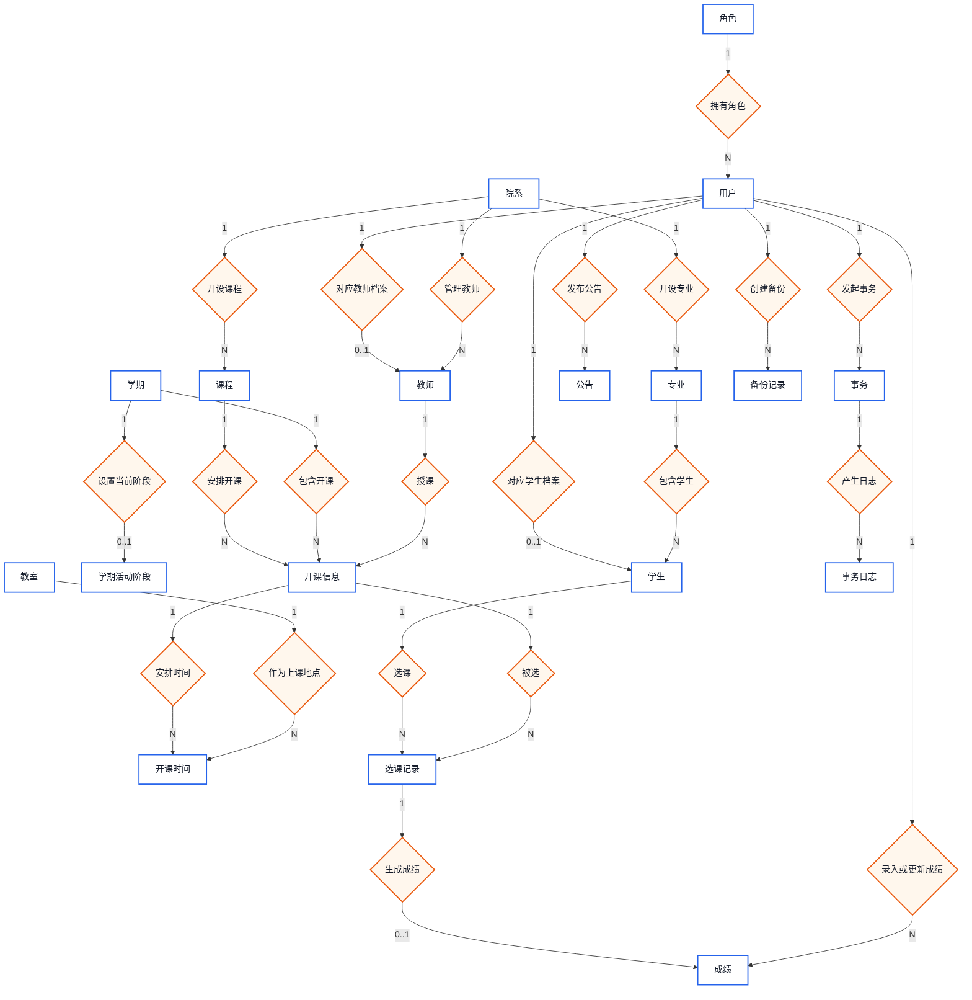

### 1.3 ER 图（表结构）

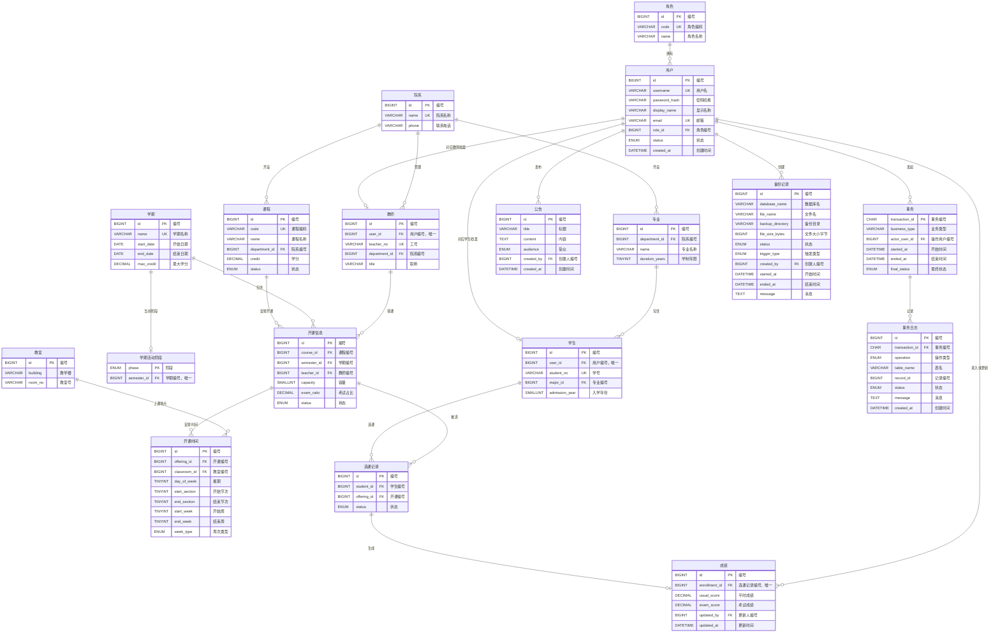

### 1.4 核心业务关系总结

| 关系                                | 类型 | 说明                         |
| ----------------------------------- | ---- | ---------------------------- |
| Role → User                         | 1:N  | 一个角色下有多个用户         |
| User → Student                      | 1:1  | 一个学生账号对应一个学生档案 |
| User → Teacher                      | 1:1  | 一个教师账号对应一个教师档案 |
| Department → Major                  | 1:N  | 一个院系下设多个专业         |
| Department → Teacher                | 1:N  | 一个院系有多位教师           |
| Major → Student                     | 1:N  | 一个专业有多名学生           |
| Department → Course                 | 1:N  | 一个院系开设多门课程         |
| Course → CourseOffering             | 1:N  | 一门课可在多学期多次开设     |
| Semester → CourseOffering           | 1:N  | 一个学期有多门开课           |
| Teacher → CourseOffering            | 1:N  | 一位教师可教授多门开课       |
| CourseOffering → CourseOfferingTime | 1:N  | 一门开课有多个上课时间段     |
| Classroom → CourseOfferingTime      | 1:N  | 教室在不同时间被多门课使用   |
| Student → Enrollment                | 1:N  | 一个学生有多条选课记录       |
| CourseOffering → Enrollment         | 1:N  | 一门开课被多个学生选择       |
| Enrollment → Grade                  | 1:1  | 一条选课记录最多一个成绩     |
| Semester → SemesterActivePhase      | 1:1  | 一个学期对应一个活跃阶段     |
| User → Notice                       | 1:N  | 一个用户可发布多条通知       |
| User → Transaction                  | 1:N  | 一个用户可发起多个业务事务   |
| Transaction → TransactionLogEntry   | 1:N  | 一个事务有多条操作日志       |

### 1.5 数据库原理

| 原理             | 应用                                                                                             | schema.sql 位置    |
| ---------------- | ------------------------------------------------------------------------------------------------ | ------------------ |
| **外键约束**     | `users.role_id → roles.id`，保证引用完整性，防止孤儿记录                                         | `schema.sql:41-51` |
| **UNIQUE 约束**  | `students.user_id` 与 `teachers.user_id` 均为 UNIQUE，确保一个用户最多对应一条档案               | `schema.sql:69-88` |
| **1:1 扩展模式** | 公共属性放 `users`，学生特有属性放 `students`，教师特有属性放 `teachers`，避免宽表冗余，符合 3NF | `schema.sql:41-88` |

---

## <font color="red">二、逻辑设计 — 各表结构</font>

### 2.1 表的五层分类

数据库共 **18 张表**，按职责分为五个层次：

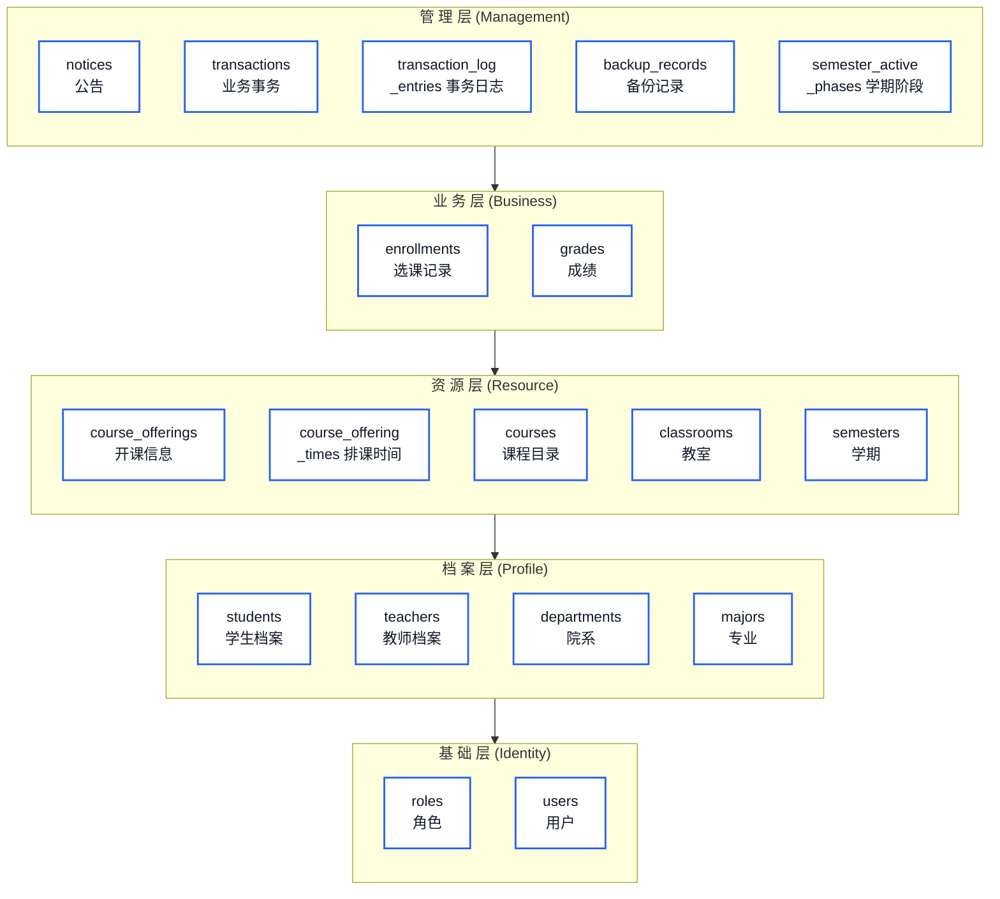

### 2.2 各表结构详解

#### 基础层

**roles** — 角色表

| 列名   | 类型        | 约束               | 说明                              |
| ------ | ----------- | ------------------ | --------------------------------- |
| `id`   | BIGINT      | PK, AUTO_INCREMENT | 角色 ID                           |
| `code` | VARCHAR(32) | NOT NULL, UNIQUE   | 角色编码（admin/teacher/student） |
| `name` | VARCHAR(64) | NOT NULL           | 角色显示名称                      |

**users** — 用户表（统一登录账号）

| 列名            | 类型                       | 约束                                | 说明                      |
| --------------- | -------------------------- | ----------------------------------- | ------------------------- |
| `id`            | BIGINT                     | PK, AUTO_INCREMENT                  | 用户 ID                   |
| `username`      | VARCHAR(64)                | NOT NULL, UNIQUE                    | 登录用户名                |
| `password_hash` | VARCHAR(255)               | NOT NULL                            | BCrypt 密码哈希（强度12） |
| `display_name`  | VARCHAR(80)                | NOT NULL                            | 显示姓名                  |
| `email`         | VARCHAR(120)               | NOT NULL, UNIQUE                    | 电子邮箱                  |
| `role_id`       | BIGINT                     | NOT NULL, FK → roles(id)            | 角色关联                  |
| `status`        | ENUM('enabled','disabled') | NOT NULL, DEFAULT 'enabled'         | 账号状态                  |
| `created_at`    | DATETIME                   | NOT NULL, DEFAULT CURRENT_TIMESTAMP | 创建时间                  |

#### 档案层

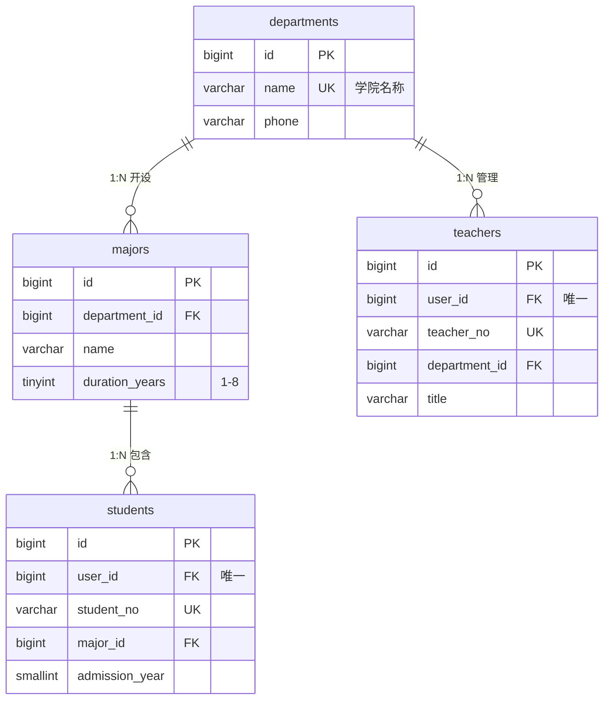

#### 资源层 — 课程、开课与排课的三层模型

这是整个系统最核心的设计。**课程（courses）** 是抽象的教学内容定义，**开课（course_offerings）** 是课程在特定学期的具体实例，**排课时间（course_offering_times）** 是开课的具体上课安排。

```
courses（课程定义）               course_offerings（开课实例）         course_offering_times（时间安排）
┌──────────────────┐           ┌──────────────────────┐         ┌──────────────────────────┐
│ code: "CS101"    │───1:N───▶│ 2024春季学期, 张三老师  │───1:N──▶│ 周一 1-2节, 1-16周, 教101 │
│ name: "数据结构"  │           │ 容量: 60人, 考试比60%  │         │ 周三 3-4节, 1-16周, 教201 │
│ credit: 4.0      │           │ status: 'selecting'   │         │ week_type: 'all'          │
└──────────────────┘           └──────────────────────┘         └──────────────────────────┘
```

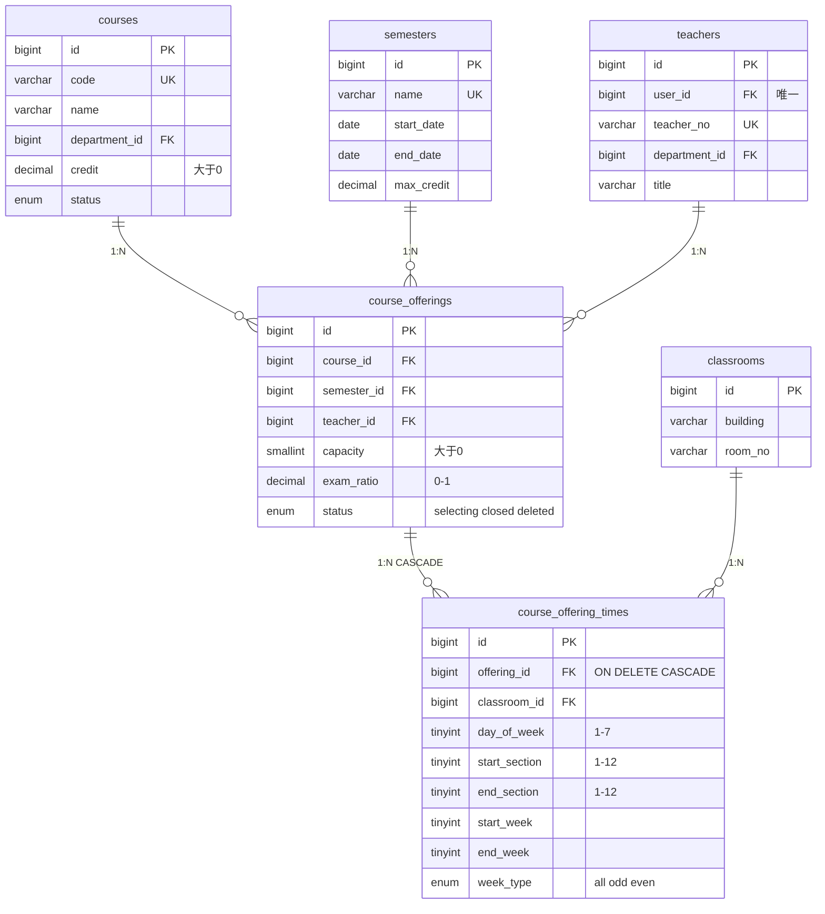

#### 业务层 — 选课与成绩

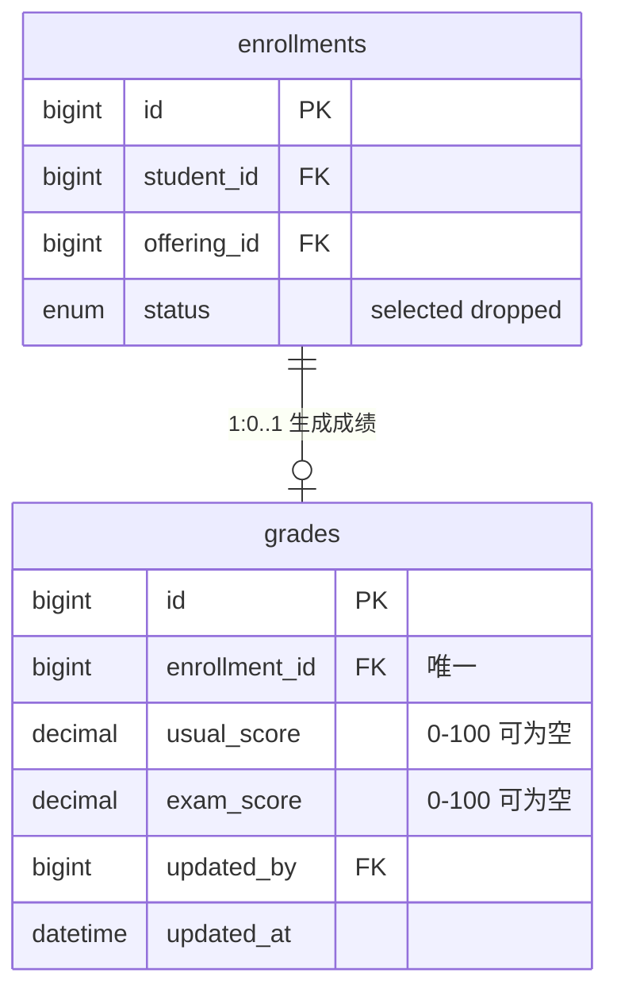

#### 排课冲突检测

系统通过 `course_offering_times` 表的 AFTER INSERT / AFTER UPDATE 触发器实现了**教师时间冲突**、**教室占用冲突**和**学生课表冲突**的自动检测：

```
时间冲突判定逻辑（day_of_week 相同的情况下）：
  时间段重叠: NOT (A.end_section < B.start_section OR A.start_section > B.end_section)
  周次重叠:   NOT (A.end_week    < B.start_week    OR A.start_week    > B.end_week)
  单双周兼容: A.week_type = 'all' OR B.week_type = 'all' OR A.week_type = B.week_type
```

#### 管理层 — 审计与通知

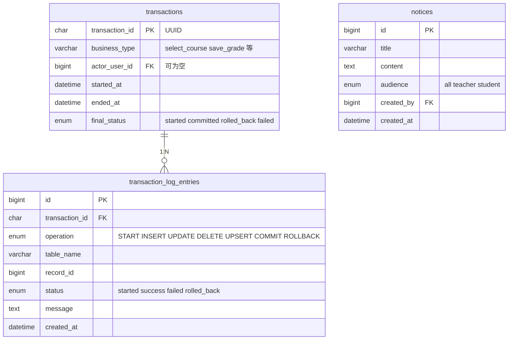

### 2.3 视图

**course_offering_stats** — 开课统计视图： LEFT JOIN 聚合 `enrollments` 中 `status='selected'` 的记录数，为每门开课提供 `selected_count` 字段。

**grade_results** — 成绩结果视图：计算 `final_score = ROUND(usual × (1 − exam_ratio) + exam × exam_ratio, 0)`，并映射为 4.0 制绩点：

```
绩点映射（分段线性）:
  90-100 → 4.0    85-89 → 3.7    82-84 → 3.3    78-81 → 3.0
  75-77 → 2.7     72-74 → 2.3    68-71 → 2.0    66-67 → 1.7
  64-65 → 1.5     60-63 → 1.0     <60   → 0.0
```

### 2.4 触发器

| 触发器                                        | 时机                                  | 功能                                     |
| --------------------------------------------- | ------------------------------------- | ---------------------------------------- |
| `trg_semesters_no_overlap_before_insert`      | BEFORE INSERT ON semesters            | 学期日期不重叠 + start ≤ end             |
| `trg_semesters_no_overlap_before_update`      | BEFORE UPDATE ON semesters            | 同上，排除自身 ID                        |
| `trg_enrollments_capacity_before_insert`      | BEFORE INSERT ON enrollments          | 选课容量校验（FOR UPDATE）               |
| `trg_enrollments_capacity_before_update`      | BEFORE UPDATE ON enrollments          | 退课重选时容量校验                       |
| `trg_course_offerings_capacity_before_update` | BEFORE UPDATE ON course_offerings     | 容量降低 + 教师/教室冲突 + 学生课表冲突  |
| `trg_offering_times_schedule_after_insert`    | AFTER INSERT ON course_offering_times | 新增时间段时教师/教室冲突 + 学生课表冲突 |
| `trg_offering_times_schedule_after_update`    | AFTER UPDATE ON course_offering_times | 修改时间段时教师/教室冲突 + 学生课表冲突 |
| `trg_notices_admin_insert`                    | BEFORE INSERT ON notices              | 仅管理员可发布通知                       |
| `trg_notices_admin_update`                    | BEFORE UPDATE ON notices              | 仅管理员可修改通知                       |

### 2.5 存储过程

| 存储过程                   | 参数                                                              | 功能                                    |
| -------------------------- | ----------------------------------------------------------------- | --------------------------------------- |
| `sp_select_course`         | student_id, offering_id, actor_user_id                            | 学生选课（7项校验 + 双重容量检查）      |
| `sp_student_drop_course`   | student_id, enrollment_id, actor_user_id                          | 学生自主退课（校验成绩未录入）          |
| `sp_admin_drop_course`     | student_id, offering_id, actor_user_id                            | 管理员强制退课（无阶段限制）            |
| `sp_admin_drop_enrollment` | enrollment_id, actor_user_id                                      | 通过选课ID退课                          |
| `sp_save_grade`            | teacher_id, enrollment_id, usual_score, exam_score, actor_user_id | 教师录入成绩（校验教师归属 + 学期匹配） |

所有存储过程均遵循**审计先写 + 固定锁顺序 + READ COMMITTED 隔离级别**的设计原则。

---

## <font color="red">三、物理设计 — 管理员、教师、学生各端功能实现</font>

### 3.1 技术架构总览

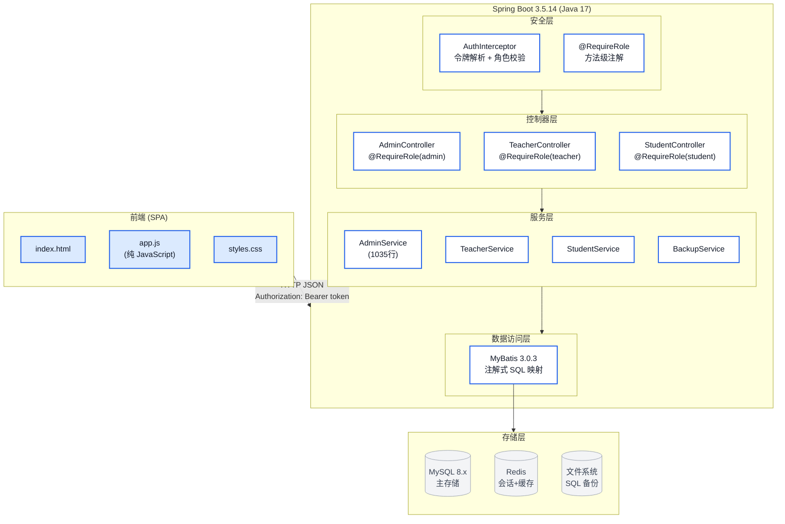

**关键技术点**：

| 层次     | 技术                               | 说明                                         |
| -------- | ---------------------------------- | -------------------------------------------- |
| 认证     | 自定义 Token (64位 UUID×2)         | 无需 Spring Security，轻量灵活               |
| 授权     | `@RequireRole` + AuthInterceptor   | 方法级注解，拦截器自动校验                   |
| 数据访问 | MyBatis 注解式 SQL                 | 无 XML 配置文件，`<script>` 标签处理动态 SQL |
| 缓存     | Redis + ConcurrentHashMap 双层     | Cache-aside 模式，Redis 故障自动降级         |
| 事务审计 | Spring AOP `@BusinessTransaction`  | 审计先写模式，REQUIRES_NEW 隔离              |
| 并发控制 | SELECT ... FOR UPDATE + 固定锁顺序 | 防止死锁和超选                               |
| 前端     | 原生 JavaScript SPA                | 无框架依赖，轻量部署                         |

---

### 3.2 管理员端功能

管理员拥有系统最高权限，所有接口均标注 `@RequireRole("admin")`，路由前缀 `/api/admin`。

#### 3.2.1 系统管理总览

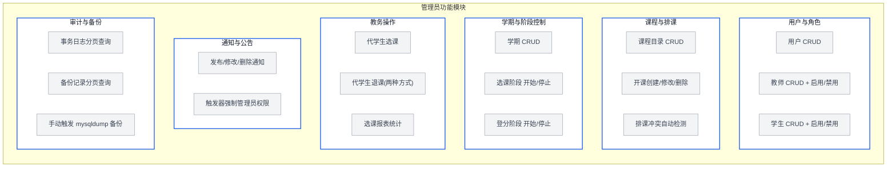

#### 3.2.2 管理员接口总表

| API                                              | 方法 | 分类 | 说明                                  |
| ------------------------------------------------ | ---- | ---- | ------------------------------------- |
| `GET /api/admin/users`                           | 查询 | 用户 | 获取所有用户列表                      |
| `POST /api/admin/users`                          | 新增 | 用户 | 创建用户                              |
| `DELETE /api/admin/users/{userId}`               | 删除 | 用户 | 删除用户（不可删自己）                |
| `GET /api/admin/teachers?keyword=`               | 查询 | 教师 | 教师列表，支持搜索                    |
| `POST /api/admin/teachers`                       | 新增 | 教师 | 创建教师（自动创建 users 档案）       |
| `PUT /api/admin/teachers/{teacherId}`            | 修改 | 教师 | 更新教师信息                          |
| `POST /api/admin/teachers/{teacherId}/disable`   | 开关 | 教师 | 禁用教师                              |
| `POST /api/admin/teachers/{teacherId}/enable`    | 开关 | 教师 | 启用教师                              |
| `GET /api/admin/students?keyword=`               | 查询 | 学生 | 学生列表，支持搜索                    |
| `POST /api/admin/students`                       | 新增 | 学生 | 创建学生（自动创建 users 档案）       |
| `PUT /api/admin/students/{studentId}`            | 修改 | 学生 | 更新学生信息                          |
| `POST /api/admin/students/{studentId}/disable`   | 开关 | 学生 | 禁用学生                              |
| `POST /api/admin/students/{studentId}/enable`    | 开关 | 学生 | 启用学生                              |
| `GET /api/admin/courses?keyword=`                | 查询 | 课程 | 课程目录                              |
| `POST /api/admin/courses`                        | 新增 | 课程 | 创建课程                              |
| `POST /api/admin/courses/{id}/enable`            | 开关 | 课程 | 启用课程                              |
| `POST /api/admin/courses/{id}/disable`           | 开关 | 课程 | 停用课程                              |
| `GET /api/admin/offerings`                       | 查询 | 开课 | 开课列表，支持学期过滤                |
| `POST /api/admin/offerings`                      | 新增 | 开课 | 创建开课（含时间安排+冲突检测）       |
| `PUT /api/admin/offerings/{id}`                  | 修改 | 开课 | 修改开课                              |
| `DELETE /api/admin/offerings/{id}`               | 删除 | 开课 | 逻辑删除（status='deleted'）          |
| `GET /api/admin/offerings/{id}/roster`           | 查询 | 开课 | 选课名单                              |
| `GET /api/admin/offerings/{id}/grade-stats`      | 查询 | 开课 | 成绩统计                              |
| `POST /api/admin/semesters`                      | 新增 | 学期 | 创建学期                              |
| `PUT /api/admin/semesters/{id}`                  | 修改 | 学期 | 修改学期                              |
| `POST /api/admin/semesters/{id}/selection/start` | 开关 | 学期 | **开放选课**（互斥：关闭旧选课+登分） |
| `POST /api/admin/semesters/{id}/selection/stop`  | 开关 | 学期 | 关闭选课                              |
| `POST /api/admin/semesters/{id}/grading/start`   | 开关 | 学期 | **开放登分**（互斥：关闭旧登分+选课） |
| `POST /api/admin/semesters/{id}/grading/stop`    | 开关 | 学期 | 关闭登分                              |
| `POST /api/admin/teaching/select`                | 操作 | 代选 | 管理员代学生选课                      |
| `POST /api/admin/teaching/drop`                  | 操作 | 代退 | 管理员代学生退课（两种方式）          |
| `POST /api/admin/notices`                        | 新增 | 通知 | 发布通知（触发器验证管理员身份）      |
| `PUT /api/admin/notices/{id}`                    | 修改 | 通知 | 修改通知                              |
| `DELETE /api/admin/notices/{id}`                 | 删除 | 通知 | 删除通知                              |
| `GET /api/admin/logs?page=&pageSize=`            | 查询 | 审计 | 事务日志分页查询                      |
| `GET /api/admin/backups?page=&pageSize=`         | 查询 | 备份 | 备份记录分页查询                      |
| `POST /api/admin/backups/run`                    | 操作 | 备份 | 手动触发数据库备份                    |

#### 3.2.3 学期阶段状态机

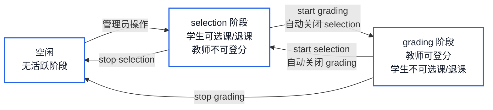

> **设计原理**: `phase` 作为 ENUM 主键确保系统全局同时只有**一条** selection 记录和**一条** grading 记录（最多两条）。开启新阶段时自动覆盖旧记录，选课与登分**互斥**——同一学期不能同时处于两个阶段。

#### 3.2.4 代选课与代退课

管理员可通过两种方式退课，灵活应对不同场景：

| 管理员退课方式    | 存储过程                   | 主要校验                                | 适用场景                     |
| ----------------- | -------------------------- | --------------------------------------- | ---------------------------- |
| 按学生 + 开课退课 | `sp_admin_drop_course`     | 学生存在、开课存在、选课为 selected     | 知道学生学号和课程序号       |
| 按选课记录退课    | `sp_admin_drop_enrollment` | 选课记录存在、学生存在、状态为 selected | 已知 enrollment_id，直接操作 |

与学生自主退课不同，管理员退课**不受学期阶段限制**，适合处理异常数据或逾期退课的人工审批场景。

---

### 3.3 教师端功能

教师端接口标注 `@RequireRole("teacher")`，路由前缀 `/api/teacher`，所有接口自动从 SessionUser 中获取教师身份。

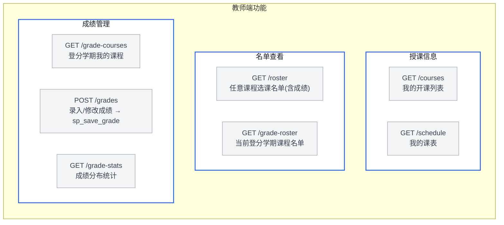

**成绩录入流程**：

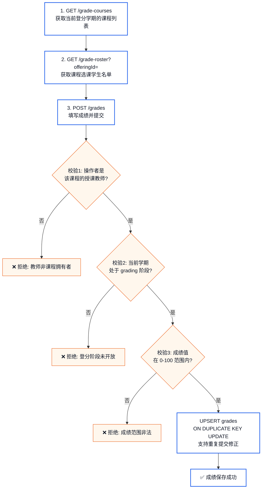

> **roster 与 grade-roster 的区别**：`roster` 可查看任意课程班的选课名单（含已有成绩），`grade-roster` 仅返回**当前登分学期**中教师负责的课程班（用于录入成绩）。

---

### 3.4 学生端功能

学生端接口标注 `@RequireRole("student")`，路由前缀 `/api/student`。`SessionUser.profile` 中自动包含 `studentId`。

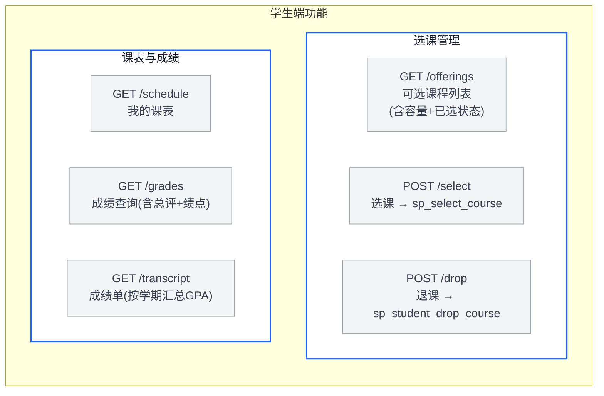

#### 3.4.1 选课业务流程

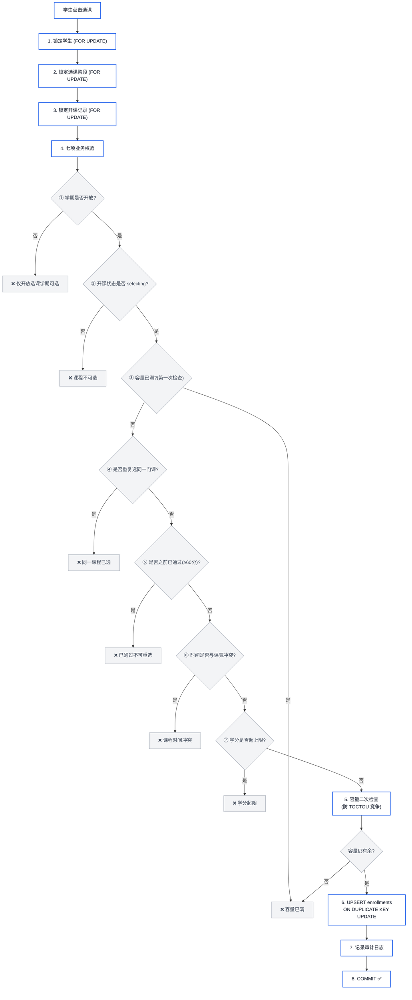

#### 3.4.2 锁顺序设计（防止死锁）

所有存储过程严格按照以下固定顺序获取行锁（`FOR UPDATE`）：

```
students → semester_active_phases → course_offerings → enrollments → grades
```

这是数据库并发控制中经典的**死锁预防**策略——通过**锁顺序约定（Lock Ordering）** 避免循环等待。

#### 3.4.3 容量的双重检查

存储过程在执行业务校验和最终插入之前**两次检查容量**，形成 **TOCTOU（Time-of-Check-Time-of-Use）** 防护：即使在校验与写入间隙有其他事务提交了选课，第二次检查也能捕获并阻止超容。

#### 3.4.4 退课的三种场景

| 场景                | 存储过程                   | 调用者  | 业务规则                             |
| ------------------- | -------------------------- | ------- | ------------------------------------ |
| 学生自主退课        | `sp_student_drop_course`   | Student | 仅在选课阶段开放；**已出成绩不可退** |
| 管理员按学生+开课退 | `sp_admin_drop_course`     | Admin   | 无需校验学期阶段，强制退选           |
| 管理员按选课记录退  | `sp_admin_drop_enrollment` | Admin   | 通过 enrollment_id 直接操作          |

---

### 3.5 学生成绩模型

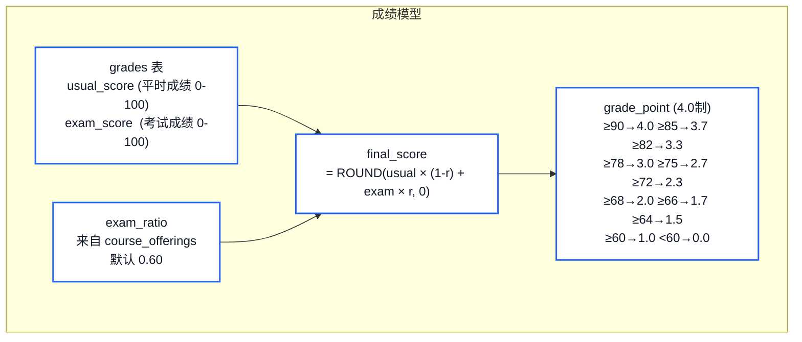

所有计算通过 `grade_results` 视图在数据库层完成，前端无需重复实现。

---

### 3.6 两阶段事务审计模式

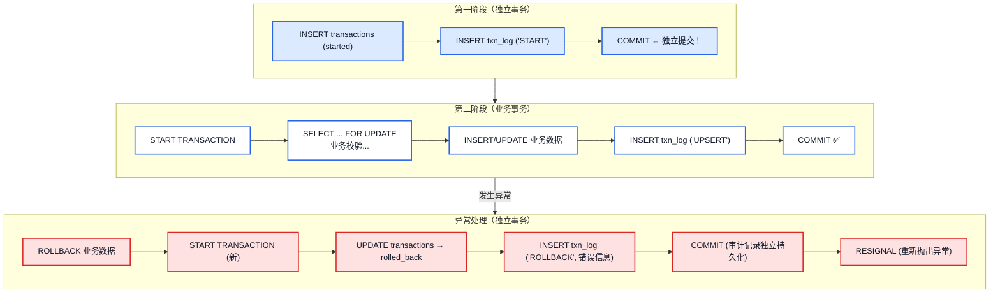

> **设计核心**: 审计日志在独立的短事务中提前提交——即使后续业务失败回滚，**审计记录也不会丢失**。异常处理中再次使用新事务记录失败原因，实现操作全链路可追溯。

---

### 3.7 安全设计总览

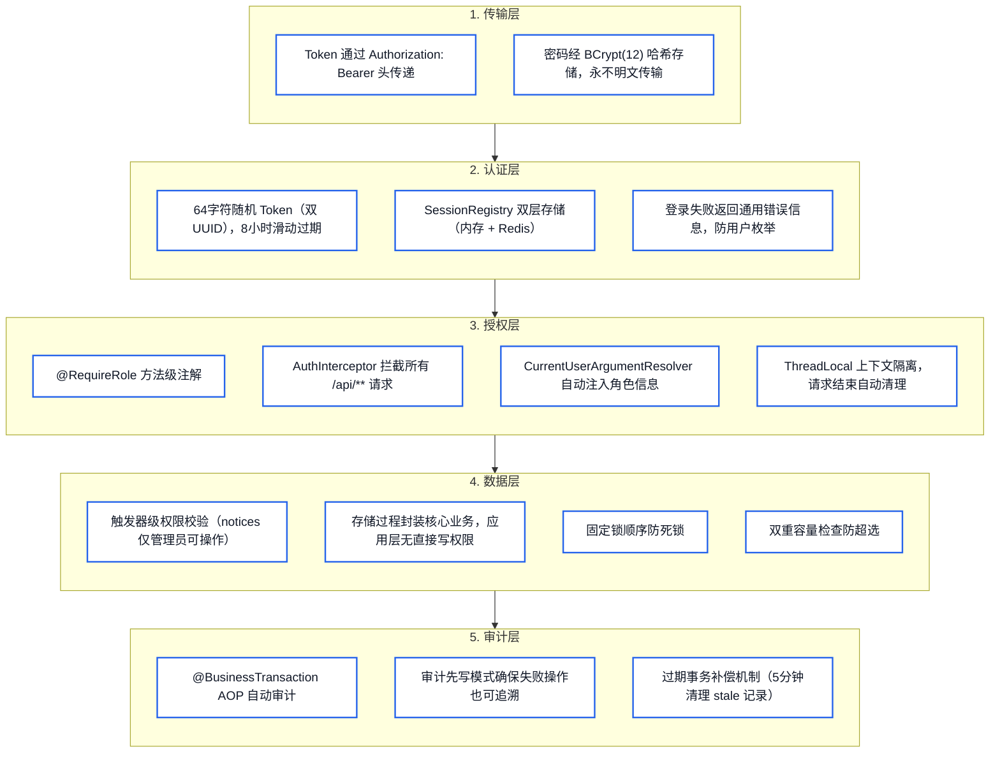

### 3.8 公共接口

| API                       | 方法 | 认证 | 说明                             |
| ------------------------- | ---- | ---- | -------------------------------- |
| `GET /api/health`         | 查询 | 无需 | 健康检查（Docker/K8s 探针）      |
| `GET /api/public/landing` | 查询 | 无需 | 登录页公开数据                   |
| `POST /api/auth/login`    | 操作 | 无需 | 用户登录，返回 token + user info |
| `POST /api/auth/logout`   | 操作 | 需要 | 登出（销毁 token）               |
| `POST /api/auth/password` | 操作 | 需要 | 修改密码（需旧密码验证）         |
| `GET /api/me`             | 查询 | 需要 | 获取当前用户信息和角色档案       |
| `GET /api/dashboard`      | 查询 | 需要 | 角色路由仪表盘                   |
| `GET /api/catalog`        | 查询 | 需要 | 全局目录（学期列表 + 公告列表）  |

### 3.9 索引策略总结

| 表                    | 索引                              | 类型   | 用途                   |
| --------------------- | --------------------------------- | ------ | ---------------------- |
| enrollments           | `uk_student_offering`             | UNIQUE | 防止学生重复选同一开课 |
| enrollments           | `idx_enrollments_offering_status` | 复合   | 统计开课已选人数       |
| enrollments           | `idx_enrollments_student_status`  | 复合   | 查询学生有效选课       |
| course_offering_times | `idx_offering_times_lookup`       | 复合   | 选课时查时间冲突       |
| course_offering_times | `idx_offering_times_room`         | 复合   | 检测教室占用冲突       |
| transactions          | `idx_transactions_started_at`     | 单列   | 按时间检索审计日志     |
| transactions          | `idx_transactions_actor`          | 单列   | 按操作人检索审计日志   |
| backup_records        | `idx_backup_records_started_at`   | 单列   | 备份记录时间排序       |
| backup_records        | `idx_backup_records_status`       | 单列   | 按状态筛选备份         |

### 3.10 数据库层物理设计要点

| 设计要点     | 具体实现                                                                   |
| ------------ | -------------------------------------------------------------------------- |
| **存储引擎** | 全部使用 InnoDB，支持事务和外键                                            |
| **字符集**   | utf8mb4 + utf8mb4_unicode_ci（支持 emoji 和全部 Unicode）                  |
| **外键约束** | 全部启用 FOREIGN_KEY_CHECKS，确保引用完整性                                |
| **索引策略** | 复合索引覆盖高频查询路径（选课冲突检测、学生课表、教室占用）               |
| **软删除**   | 几乎所有"删除"都是状态标记（`dropped`/`disabled`/`deleted`），保留可追溯性 |
| **行级锁**   | 选课等高并发场景使用 `SELECT ... FOR UPDATE` 配合固定锁顺序                |
| **审计**     | 应用层 AOP + 存储过程事务审计双重保障                                      |
| **备份**     | 定时（每天凌晨 2:00）+ 手动双模式，保留最近 10 份备份                      |
| **定时任务** | Spring `@Scheduled` 处理备份计划和过期事务补偿（每 5 分钟）                |

---

## 附录：关键数据库原理汇总

| 原理                  | 在项目中的应用                                                    | schema.sql 位置       |
| --------------------- | ----------------------------------------------------------------- | --------------------- |
| **ACID 事务**         | 选课/退课/登分存储过程的手动事务控制                              | `schema.sql:582-738`  |
| **悲观锁**            | `SELECT ... FOR UPDATE` 防止并发超选                              | `schema.sql:610-637`  |
| **死锁预防**          | 统一锁顺序 `students → phases → offerings → enrollments → grades` | `schema.sql:557-558`  |
| **隔离级别**          | `READ COMMITTED` 平衡一致性与并发性能                             | `schema.sql:598-600`  |
| **外键约束**          | 18 张物理表之间通过外键维护引用完整性                             | `schema.sql:41-247`   |
| **CHECK 约束**        | 成绩范围、学分>0、容量>0、日期范围、节次周次范围                  | `schema.sql:59-247`   |
| **UNIQUE 约束**       | 用户名、邮箱、学号、工号、选课唯一性、教室唯一性                  | `schema.sql:35-247`   |
| **ON DELETE CASCADE** | 开课删除时级联删除排课时间；学期删除时级联删除激活阶段            | `schema.sql:100-166`  |
| **触发器**            | 学期日期重叠、容量限制、排课冲突、通知权限                        | `schema.sql:251-512`  |
| **视图**              | 成绩总评与绩点计算、开课统计                                      | `schema.sql:514-555`  |
| **存储过程**          | 5 个核心业务操作的完整实现                                        | `schema.sql:559-1224` |
| **规范化（3NF）**     | users/students/teachers 分离，courses/offerings/times 分离        | `schema.sql:41-166`   |
| **复合索引**          | 按查询模式设计多列索引加速冲突检测和统计分析                      | `schema.sql:164-177`  |
| **幂等设计**          | `ON DUPLICATE KEY UPDATE` 实现选课和登分的重入安全                | `schema.sql:722-726`  |
| **审计分离**          | 业务事务与审计事务独立提交，保证审计完整性                        | `schema.sql:601-606`  |

---

## 附录：项目文件结构速查

```
eduAffairSQL-main/
├── pom.xml                              # Maven 构建配置 (Spring Boot 3.5.14)
├── database/
│   ├── schema.sql                       # DDL（18表 + 9触发器 + 2视图 + 5存储过程）
│   ├── data.sql                         # 种子数据
│   ├── schema.md                        # schema.sql 详细文档
│   └── explain.md                       # 设计合理性分析文档
├── backups/                             # 定时备份文件存放
├── scripts/
│   ├── backup_database.ps1              # Windows 备份脚本
│   └── backup_database.sh               # Unix 备份脚本
└── src/main/
    ├── java/com/student/management/
    │   ├── TeachingAffairsApplication.java
    │   ├── common/                      # ApiResponse, PasswordUtil, AOP审计
    │   ├── config/                      # WebConfig, CurrentUserArgumentResolver
    │   ├── security/                    # SessionUser, SessionRegistry, AuthInterceptor, @RequireRole
    │   ├── controller/                  # REST API 控制器（6个）
    │   ├── dto/                         # 请求/响应 DTO（全部 Java 17 record）
    │   ├── mapper/                      # MyBatis SQL 映射接口（6个）
    │   └── service/                     # 业务逻辑服务（7个）
    └── resources/
        ├── application.yml              # 应用配置（DB/Redis/MyBatis/Backup）
        └── static/
            ├── index.html               # SPA 入口
            ├── app.js                   # 前端逻辑（纯 JavaScript）
            └── styles.css               # 样式表
```
