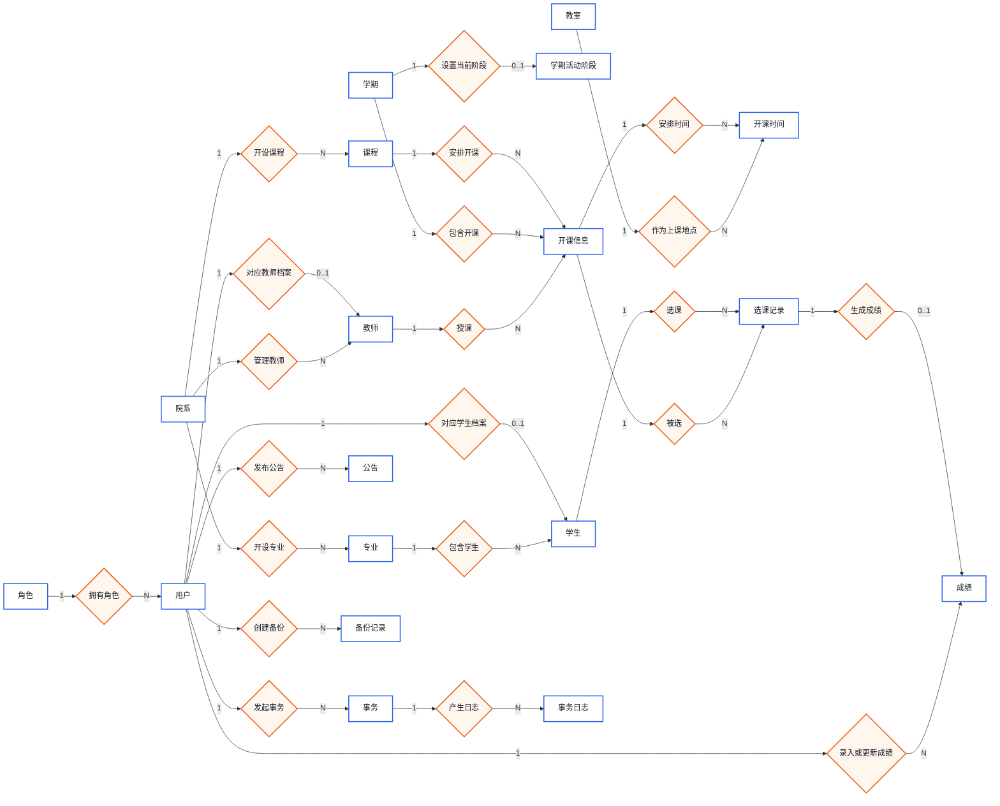
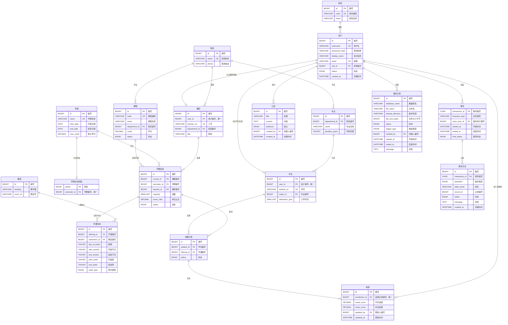
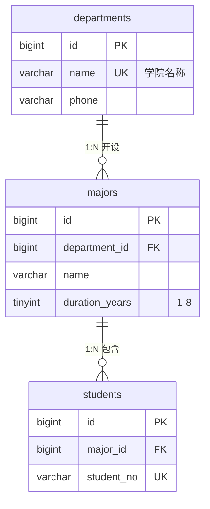
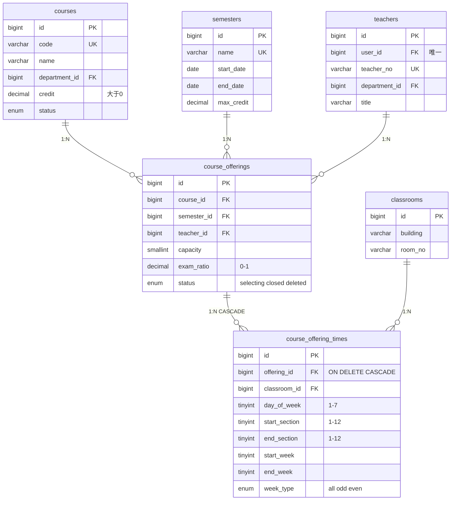
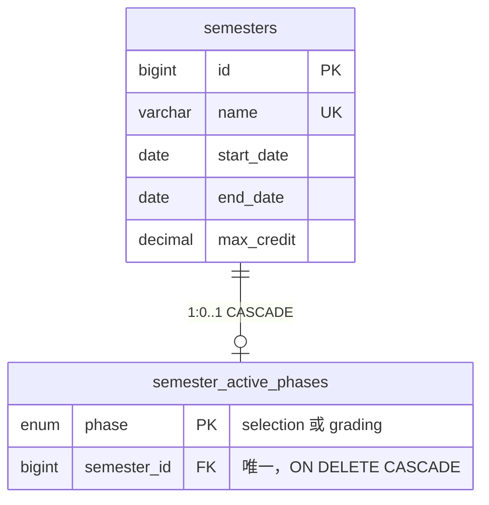
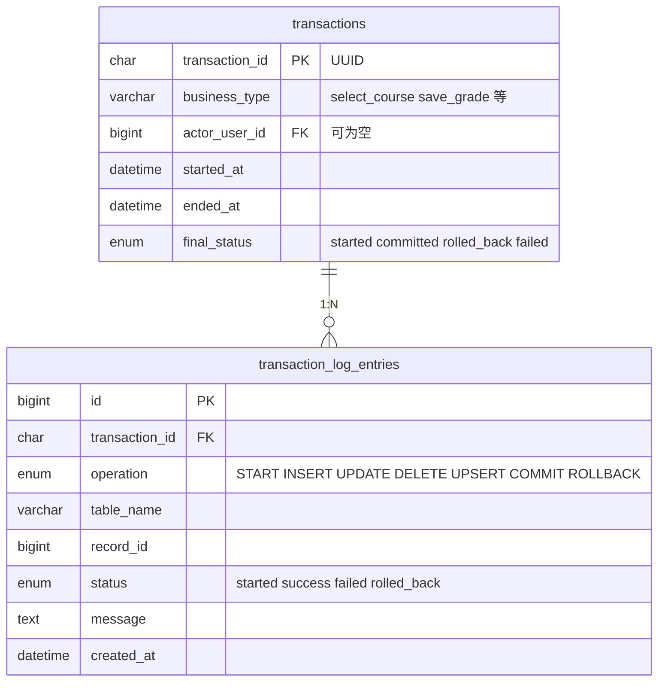

# 高校教务选课系统 —— 数据库设计与实现

---

> 说明：各“数据库原理”表格中的 `schema.sql:x-y` 表示该原理在最初 SQL 文件中的对应代码行号。

## 一、项目概述

本系统是一个基于 MySQL 的高校教务管理平台，涵盖**用户与角色管理、学院专业体系、课程开设与排课、学生选课与退课、成绩录入与绩点计算、通知公告、事务审计与备份**等完整教务流程。数据库共 18 张物理表，覆盖核心教务业务表以及事务审计、备份等系统辅助表；另包含 2 张视图、5 个存储过程、9 个触发器，并通过应用层事务日志表实现了业务操作的全链路追踪。

---

## 二、系统架构总览

```
┌──────────────────────────────────────────────────────────────┐
│                    教务选课系统数据库架构                         │
├────────────┬────────────┬────────────┬────────────┬───────────┤
│  用户体系   │  教学资源    │  选课业务   │  成绩管理   │  系统服务   │
├────────────┼────────────┼────────────┼────────────┼───────────┤
│ roles      │ departments│ semesters  │ grades     │ notices   │
│ users      │ majors     │ courses    │(grade_results)│transactions│
│ students   │ classrooms │ course_    │            │ txn_log   │
│ teachers   │            │ offerings  │            │ backup    │
│            │            │ offer_times│            │ records   │
│            │            │ enrollments│            │           │
└────────────┴────────────┴────────────┴────────────┴───────────┘
```

---

## 三、用户角色体系

### 3.1 设计思路

系统采用 **RBAC（基于角色的访问控制）** 模型。`roles` 表存储角色定义，`users` 表统一管理所有用户的登录凭据，`students` 和 `teachers` 表作为用户 profile 的扩展，通过 `user_id` 建立 1:1 关联。需要注意的是，数据库当前保证“一个用户在 students 表中最多一条记录、在 teachers 表中最多一条记录”，但未通过跨表约束强制学生与教师身份互斥。

### 3.2 表结构关系






### 3.3 数据库原理

| 原理 | 应用 | schema.sql 位置 |
|------|------|----------------|
| **外键约束** | `users.role_id → roles.id`，保证引用完整性，防止孤儿记录 | `schema.sql:41-51` |
| **UNIQUE 约束** | `students.user_id` 与 `teachers.user_id` 均为 UNIQUE，并分别外键引用 `users.id`，确保一个用户在学生表中最多对应一条学生档案，在教师表中最多对应一条教师档案 | `schema.sql:69-88` |
| **1:1 扩展模式** | 将公共属性放 `users`，学生特有属性（学号、专业）放 `students`，教师特有属性（工号、院系、职称）放 `teachers`，避免宽表冗余，符合**数据库规范化**第三范式（3NF） | `schema.sql:41-51`, `schema.sql:69-88` |

### 3.4 用户视角

> **学生 Alice**：用学号 `2024001` 登录，系统通过 `users` 表验证密码哈希，再通过 `user_id` 关联到 `students` 表获取其专业和入学年份。

> **教师 Bob**：用工号 `T001` 登录，系统关联 `teachers` 表获取其所属学院和职称（讲师/副教授/教授）。

> **管理员 Carol**：`users.role_id` 指向 `roles.code = 'admin'`，拥有发布通知、管理学期阶段等特权。

---

## 四、学院与专业体系

### 4.1 表结构



### 4.2 数据库原理

| 原理 | 应用 | schema.sql 位置 |
|------|------|----------------|
| **复合唯一约束** | `UNIQUE(department_id, name)` — 同一学院下专业名不可重复，但不同学院可有同名专业（如"计算机科学与技术"同时存在于信息学院和软件学院） | `schema.sql:59-67` |
| **CHECK 约束** | `duration_years BETWEEN 1 AND 8` — 在数据库层面保证学制合法性 | `schema.sql:59-67` |
| **级联关系** | 学生通过 `major_id` 关联专业，专业通过 `department_id` 关联院系，形成清晰的层次依赖 | `schema.sql:59-78` |

---

## 五、课程与排课体系

### 5.1 核心设计：课程 → 开课 → 排课的三层模型

这是整个系统最核心的设计。**课程（courses）** 是抽象的教学内容定义，**开课（course_offerings）** 是课程在特定学期的具体实例，**排课时间（course_offering_times）** 是开课的具体上课安排。

```
courses（课程定义）               course_offerings（开课实例）         course_offering_times（时间安排）
┌──────────────────┐           ┌──────────────────────┐         ┌──────────────────────────┐
│ code: "CS101"    │───1:N───▶│ 2024春季学期, 张三老师  │───1:N──▶│ 周一 1-2节, 1-16周, 教101 │
│ name: "数据结构"  │           │ 容量: 60人, 考试比60%  │         │ 周三 3-4节, 1-16周, 教201 │
│ credit: 4.0      │           │ status: 'selecting'   │         │ week_type: 'all'          │
└──────────────────┘           └──────────────────────┘         └──────────────────────────┘
```

### 5.2 表结构详解



### 5.3 排课冲突检测（触发器核心）

系统通过 `course_offering_times` 表的 AFTER INSERT / AFTER UPDATE 触发器实现了**教师时间冲突**和**教室占用冲突**的自动检测：

```
时间冲突判定逻辑（day_of_week 相同的情况下）：
  时间段重叠: NOT (A.end_section < B.start_section OR A.start_section > B.end_section)
  周次重叠:   NOT (A.end_week    < B.start_week    OR A.start_week    > B.end_week)
  单双周兼容: A.week_type = 'all' OR B.week_type = 'all' OR A.week_type = B.week_type
```

### 5.4 数据库原理

| 原理 | 应用 | schema.sql 位置 |
|------|------|----------------|
| **三层抽象模型** | courses（元数据）→ course_offerings（实例化）→ course_offering_times（具体化），降低数据冗余 | `schema.sql:108-117`, `schema.sql:126-166` |
| **ON DELETE CASCADE** | `course_offering_times.offering_id` 外键设置 CASCADE — 删除开课时自动清理其所有排课时间记录 | `schema.sql:145-166` |
| **复合索引** | `idx_offering_times_lookup` 与 `idx_offering_times_room` 加速排课与冲突检测查询 | `schema.sql:164-165` |
| **CHECK 约束栈** | 多个 CHECK 约束确保 day_of_week(1-7)、section(1-12)、week(1-30)、start ≤ end | `schema.sql:157-163` |
| **触发器** | `course_offering_times` 使用 AFTER INSERT / AFTER UPDATE 触发器检测排课冲突；`course_offerings` 使用 BEFORE UPDATE 触发器检查容量以及修改开课信息后的冲突风险 | `schema.sql:335-398`, `schema.sql:400-512` |

---

## 六、选课业务

### 6.1 选课流程（存储过程 `sp_select_course`）

选课是最复杂的业务操作，通过存储过程实现，采用**手动事务控制 + 悲观锁**保证并发安全。

```
选课业务流程：
┌──────────┐    ┌──────────┐    ┌─────────────┐    ┌──────────────┐
│ 1.锁定学生 │───▶│2.锁定选课  │───▶│ 3.锁定开课记录 │───▶│4.七项业务校验 │
│  (FOR     │    │ 阶段     │    │  (FOR UPDATE) │    │              │
│  UPDATE)  │    │         │    │              │    │              │
└──────────┘    └──────────┘    └─────────────┘    └──────────────┘
                                                         │
                                                         ▼
                                                ┌─────────────────┐
                                                │ ① 学期是否开放？   │
                                                │ ② 开课状态是否可选？ │
                                                │ ③ 容量是否已满？    │
                                                │ ④ 是否重复选课？    │
                                                │ ⑤ 是否已通过该课？  │
                                                │ ⑥ 时间是否冲突？    │
                                                │ ⑦ 学分上限是否超？  │
                                                └────────┬────────┘
                                                         │ 全部通过
                                                         ▼
                                                ┌─────────────────┐
                                                │ 5. INSERT/      │
                                                │    UPSERT 选课   │
                                                │ 6. 记录事务日志   │
                                                │ 7. COMMIT       │
                                                └─────────────────┘
```

### 6.2 锁顺序设计（防止死锁）

```sql
-- 固定锁顺序:
-- students → semester_active_phases → course_offerings → enrollments → grades
```

所有存储过程严格按照此顺序获取行锁（`FOR UPDATE`），这是数据库并发控制中的经典**死锁预防**策略——通过**锁顺序约定（Lock Ordering）** 避免循环等待。

### 6.3 容量的双重检查

存储过程在执行业务校验和最终插入之前**两次检查容量**（第 698-701 行 与 713-720 行），形成 TOCTOU（Time-of-Check-Time-of-Use）防护：即使在校验与写入间隙有其他事务提交了选课，第二次检查也能捕获并阻止超容。

### 6.4 用户视角

> **学生 Alice** 选课时，系统在 ~100 行存储过程代码中依次完成：确认她是合法学生 → 确认当前学期选课阶段已开放 → 确认该开课容量未满 → 确认她没有选过同名课程 → 确认她之前没有以 ≥60 分通过该课 → 确认新课时间与她现有课表不冲突 → 确认总学分不超上限 → 写入选课记录。

### 6.5 数据库原理

| 原理 | 应用 | schema.sql 位置 |
|------|------|----------------|
| **ACID 事务** | 手动 `START TRANSACTION` / `COMMIT` / `ROLLBACK` 确保选课操作原子性 | `schema.sql:582-606`, `schema.sql:608-738` |
| **悲观锁 (Pessimistic Locking)** | `SELECT ... FOR UPDATE` 对学生、当前选课阶段、开课记录等关键行加排他锁，防止并发超选 | `schema.sql:610-637`, `schema.sql:713-720` |
| **隔离级别** | `READ COMMITTED` — 在保证已提交读的前提下降低锁竞争，配合 `FOR UPDATE` 保证关键数据的一致性 | `schema.sql:598-600` |
| **死锁预防** | 通过固定锁顺序 `students → semester_active_phases → course_offerings → enrollments → grades` 降低循环等待风险 | `schema.sql:557-558`, `schema.sql:610-637` |
| **幂等设计** | `ON DUPLICATE KEY UPDATE` 使选课操作可重复执行，已退选学生重新选课时更新状态而非报错 | `schema.sql:168-178`, `schema.sql:722-726` |
| **审计分离** | 事务日志先独立提交 START 记录，业务失败时再独立记录 ROLLBACK，避免审计信息随业务回滚丢失 | `schema.sql:601-606`, `schema.sql:582-594`, `schema.sql:728-737` |

---

## 七、退课业务

### 7.1 三种退课场景

| 场景 | 存储过程 | 调用者 | 业务规则 |
|------|----------|--------|----------|
| 学生自主退课 | `sp_student_drop_course` | Student | 仅在选课阶段开放时；**已出成绩的课程不可退** |
| 管理员按学生+开课退 | `sp_admin_drop_course` | Admin | 管理员无需校验学期阶段，强制退选 |
| 管理员按选课记录退 | `sp_admin_drop_enrollment` | Admin | 通过 enrollment_id 直接操作 |

### 7.2 已出成绩不可退的保护逻辑

```sql
-- sp_student_drop_course 中的校验:
SELECT COUNT(*) INTO v_grade_count
  FROM grades
 WHERE enrollment_id = p_enrollment_id
   AND usual_score IS NOT NULL
   AND exam_score IS NOT NULL;
-- 如果 v_grade_count > 0，拒绝退课
```

### 7.3 用户视角

> **学生 Alice** 想退掉一门课：她登录后在"我的课表"中点击退课，系统调用 `sp_student_drop_course`，校验选课阶段是否还在开放期，且该课尚未被老师录入成绩。如果老师已经打了分，Alice 将看到「已出成绩的课程不可退选」的提示。

> **管理员 Carol** 接到学生电话求助：Alice 错过退课期限。Carol 在后台通过 `sp_admin_drop_enrollment` 绕过学期阶段限制，为该学生退课。

---

## 八、成绩管理

### 8.1 成绩模型

```
grades 表:
┌────────────┬──────────────┬──────────────┐
│ usual_score│ exam_score   │ final_score  │
│ (平时成绩)  │ (考试成绩)    │ (总评成绩)    │
│ 0-100      │ 0-100        │ = usual*(1-r)│
│            │              │ + exam*r     │
└────────────┴──────────────┴──────────────┘
               exam_ratio 来自 course_offerings（默认 0.60）
```

### 8.2 绩点视图 `grade_results`

系统通过视图计算总评成绩和绩点（GPA），无需在表中冗余存储：

```
总评成绩 = ROUND(平时成绩 × (1 - 考试占比) + 考试成绩 × 考试占比, 0)

绩点映射（分段线性）:
  90-100 → 4.0    85-89 → 3.7    82-84 → 3.3    78-81 → 3.0
  75-77 → 2.7     72-74 → 2.3    68-71 → 2.0    66-67 → 1.7
  64-65 → 1.5     60-63 → 1.0     <60   → 0.0
```

### 8.3 成绩录入流程（`sp_save_grade`）

```sql
-- 核心校验:
-- 1. 成绩范围 0-100（存储过程层面）
-- 2. 成绩范围 CHECK 约束（数据库层面，双重保障）
-- 3. 确认当前为 grading 阶段
-- 4. 确认录入教师是开课教师本人
-- 5. ON DUPLICATE KEY UPDATE 支持成绩修改
```

### 8.4 数据库原理

| 原理 | 应用 | schema.sql 位置 |
|------|------|----------------|
| **视图（View）** | `grade_results` 封装了总评计算 + 绩点映射逻辑，应用程序无需重复实现 | `schema.sql:526-555` |
| **CHECK 约束** | `usual_score BETWEEN 0 AND 100`, `exam_score BETWEEN 0 AND 100` — 数据库强制数据有效性 | `schema.sql:180-191` |
| **冗余消除** | `final_score` 和 `grade_point` 不存储在表中，而是在视图中实时计算，避免数据不一致 | `schema.sql:526-555` |
| **时态数据** | `updated_at` 使用 `ON UPDATE CURRENT_TIMESTAMP` 自动记录最后修改时间 | `schema.sql:180-191` |
| **外键可空** | `updated_by` 允许 NULL，并通过外键关联 `users.id`，兼顾可追溯性与兼容性 | `schema.sql:180-191` |
| **登分权限与阶段控制** | `sp_save_grade` 校验成绩范围、当前 grading 阶段、授课教师身份，并用 UPSERT 写入成绩 | `schema.sql:1086-1224` |

### 8.5 用户视角

> **教师 Bob** 在期末登分阶段登录系统，为他的《数据结构》课程录入成绩。系统调用 `sp_save_grade`，依次校验：(1) Bob 是该开课的授课教师；(2) 当前处于 grading 阶段；(3) 该学期正是该开课所在的学期。全部通过后，成绩写入 grades 表。

> **学生 Alice** 在成绩查询页面看到的是 `grade_results` 视图的结果——总评成绩和对应的绩点已由数据库自动计算完成，前端只需展示。

---

## 九、学期管理与阶段控制

### 9.1 设计



`semester_active_phases` 表是整个系统的**状态机控制器**：

- `phase = 'selection'` → 学生可以选课/退课，教师不能登分
- `phase = 'grading'` → 教师可以登分，学生不能选课/退课
- 同一时刻每个阶段最多只能绑定一个学期；同一学期也不能同时绑定多个阶段

### 9.2 学期日期重叠检测（触发器）

```sql
-- trg_semesters_no_overlap_before_insert:
-- 新学期的日期区间不得与任何现有学期重叠
WHERE s.start_date <= NEW.end_date AND s.end_date >= NEW.start_date
```

### 9.3 数据库原理

| 原理 | 应用 | schema.sql 位置 |
|------|------|----------------|
| **状态机模式** | `semester_active_phases.phase` 以 ENUM 主键保证每个阶段全局最多绑定一个学期；`semester_id` 的 UNIQUE 约束保证同一学期不能同时绑定多个阶段 | `schema.sql:100-106` |
| **触发器守门** | `BEFORE INSERT/UPDATE` 触发器阻止日期重叠的学期数据写入 | `schema.sql:251-286` |
| **CASCADE 删除** | 删除学期时自动清除对应的激活阶段 | `schema.sql:100-106` |

---

## 十、通知系统

### 10.1 设计

```sql
CREATE TABLE notices (
  id BIGINT PRIMARY KEY AUTO_INCREMENT,
  title VARCHAR(120) NOT NULL,
  content TEXT NOT NULL,
  audience ENUM('all','teacher','student') NOT NULL DEFAULT 'all',
  created_by BIGINT NOT NULL,  -- FK → users.id
  created_at DATETIME NOT NULL DEFAULT CURRENT_TIMESTAMP
);
```

### 10.2 权限控制

通过触发器 `trg_notices_admin_insert` / `trg_notices_admin_update` 确保**只有管理员可以发布通知**：

```sql
IF NOT EXISTS (
  SELECT 1 FROM users u JOIN roles r ON r.id = u.role_id
  WHERE u.id = NEW.created_by AND r.code = 'admin'
) THEN
  SIGNAL SQLSTATE '45000' SET MESSAGE_TEXT = 'Only administrators can publish notices';
END IF;
```

### 10.3 数据库原理

| 原理 | 应用 | schema.sql 位置 |
|------|------|----------------|
| **触发器实现行级安全** | 在数据库层实现"仅管理员可发布通知"的规则，即使应用层存在漏洞也无法绕过 | `schema.sql:1228-1258` |
| **audience 枚举** | 支持面向全体 / 仅教师 / 仅学生的定向推送 | `schema.sql:193-201` |
| **创建人外键** | `created_by` 外键关联 `users.id`，用于追踪公告发布人，并配合触发器校验其角色 | `schema.sql:193-201`, `schema.sql:1228-1258` |

### 10.4 用户视角

> **管理员 Carol** 发布通知：「2024 春季学期选课将于 3 月 1 日开始」。通知存储时自动设置 `audience='all'` 和 `created_by=Carol的user_id`。触发器检查 Carol 的角色为 admin 后允许写入。

> **学生 Alice** 登录后看到该通知（她的角色为 student，匹配 `audience IN ('all', 'student')`）。

> **教师 Bob** 登录后同样看到该通知（`audience = 'all'` 覆盖教师角色）。

> 如果某教师试图通过 SQL 注入直接插入 notices 记录，触发器会检测到其 `role_id` 对应角色非 admin 并拒绝操作——**数据库层面的最后防线**。

---

## 十一、事务审计系统

### 11.1 设计理念

系统需要追踪所有关键业务操作（选课、退课、登分），但传统方案有两个痛点：
1. 业务回滚会导致审计日志也丢失
2. 长事务中无法看到中间状态

本系统的解决方案是**审计日志独立事务提交**——每个存储过程使用两阶段提交模式。

### 11.2 两阶段事务模式

```
第一阶段（独立事务）：                   第二阶段（业务事务）：
┌──────────────────────────┐         ┌──────────────────────────┐
│ INSERT INTO transactions │         │ START TRANSACTION        │
│   (started)              │         │                          │
│ INSERT INTO txn_log      │         │ SELECT ... FOR UPDATE    │
│   ('START')              │         │ 业务校验...               │
│ COMMIT  ← 独立提交！      │         │ INSERT/UPDATE 业务数据    │
└──────────────────────────┘         │ INSERT INTO txn_log      │
                                     │   ('UPSERT' / 'COMMIT')  │
         ← 即使这里回滚，              │ COMMIT                   │
           审计记录也不会丢失 →         └──────────────────────────┘
```

### 11.3 表结构



### 11.4 异常处理

```sql
DECLARE EXIT HANDLER FOR SQLEXCEPTION
BEGIN
  GET DIAGNOSTICS CONDITION 1 v_error_message = MESSAGE_TEXT;
  ROLLBACK;                                    -- 回滚业务数据
  START TRANSACTION;                            -- 新事务
  UPDATE transactions SET final_status = 'rolled_back' ...
  INSERT INTO txn_log ... VALUES('ROLLBACK', ... v_error_message)
  COMMIT;                                       -- 审计记录独立提交
  RESIGNAL;                                     -- 重新抛出异常
END;
```

### 11.5 数据库原理

| 原理 | 应用 | schema.sql 位置 |
|------|------|----------------|
| **审计日志分离** | 审计记录独立事务提交，业务回滚不影响审计完整性 | `schema.sql:203-228`, `schema.sql:601-606`, `schema.sql:582-594` |
| **RESIGNAL** | 存储过程捕获异常、记录审计后重新抛出，确保上层应用也能感知错误 | `schema.sql:582-595`, `schema.sql:756-769`, `schema.sql:1105-1118` |
| **UUID 主键** | `transaction_id` 使用 CHAR(36) UUID，避免分布式场景下的主键冲突 | `schema.sql:203-213`, `schema.sql:598-603` |
| **EXIT HANDLER** | MySQL 异常处理机制，确保选课、退课、登分等业务发生错误时都能正确记录审计信息 | `schema.sql:582-595`, `schema.sql:756-769`, `schema.sql:893-906`, `schema.sql:997-1010`, `schema.sql:1105-1118` |

---

## 十二、数据库备份记录

```sql
CREATE TABLE backup_records (
  id BIGINT PRIMARY KEY AUTO_INCREMENT,
  database_name VARCHAR(64) NOT NULL,
  file_name VARCHAR(255) NOT NULL,
  backup_directory VARCHAR(512) NOT NULL,
  file_size_bytes BIGINT NULL,
  status ENUM('started','success','failed','deleted'),
  trigger_type ENUM('scheduled','manual'),
  created_by BIGINT NULL,   -- FK → users.id
  started_at DATETIME,
  ended_at DATETIME,
  message TEXT
);
```

系统通过此表追踪每次数据库备份的状态，支持**定时自动备份**和**手动备份**两种触发模式，记录备份文件路径、大小、耗时和结果；其中 `created_by` 可为空，用于兼容系统定时任务触发的备份。

---

## 十三、索引策略总结

| 表 | 索引 | 类型 | 用途 |
|-----|------|------|------|
| enrollments | `uk_student_offering` | UNIQUE | 防止学生重复选同一开课 |
| enrollments | `idx_enrollments_offering_status` | 复合 | 统计开课已选人数 |
| enrollments | `idx_enrollments_student_status` | 复合 | 查询学生有效选课 |
| course_offering_times | `idx_offering_times_lookup` | 复合 | 选课时查时间冲突 |
| course_offering_times | `idx_offering_times_room` | 复合 | 检测教室占用冲突 |
| transactions | `idx_transactions_started_at` | 单列 | 按时间检索审计日志 |
| transactions | `idx_transactions_actor` | 单列 | 按操作人检索审计日志 |
| backup_records | `idx_backup_records_started_at` | 单列 | 备份记录时间排序 |
| backup_records | `idx_backup_records_status` | 单列 | 按状态筛选备份 |

---

## 十四、关键数据库原理汇总

| 原理 | 在项目中的应用 | schema.sql 位置 |
|------|---------------|----------------|
| **ACID 事务** | 选课/退课/登分存储过程的手动事务控制 | `schema.sql:582-738`, `schema.sql:740-878`, `schema.sql:1086-1224` |
| **悲观锁 (Pessimistic Locking)** | `SELECT ... FOR UPDATE` 防止并发超选 | `schema.sql:610-637`, `schema.sql:794-831`, `schema.sql:1148-1195` |
| **死锁预防** | 统一锁顺序 `students → phases → offerings → enrollments → grades` | `schema.sql:557-558` |
| **隔离级别** | `READ COMMITTED` 平衡一致性与并发性能 | `schema.sql:598-600`, `schema.sql:772-774`, `schema.sql:1121-1123` |
| **外键约束** | 18 张物理表之间通过外键维护引用完整性 | `schema.sql:41-247` |
| **CHECK 约束** | 成绩范围、学分 >0、容量 >0、日期范围、节次周次范围等 | `schema.sql:59-67`, `schema.sql:90-98`, `schema.sql:108-117`, `schema.sql:126-166`, `schema.sql:180-191`, `schema.sql:230-247` |
| **UNIQUE 约束** | 用户名、邮箱、学号、工号、选课唯一性、教室唯一性等 | `schema.sql:35-247` |
| **ON DELETE CASCADE** | 开课删除时级联删除排课时间；学期删除时级联删除激活阶段 | `schema.sql:100-106`, `schema.sql:145-166` |
| **触发器** | 学期日期重叠、容量限制、排课冲突、通知权限 | `schema.sql:251-512`, `schema.sql:1228-1258` |
| **视图** | 成绩总评与绩点计算、开课统计 | `schema.sql:514-555` |
| **存储过程** | 5 个核心业务操作的完整实现 | `schema.sql:559-1224` |
| **规范化（3NF）** | users/students/teachers 分离，courses/offerings/times 分离 | `schema.sql:41-88`, `schema.sql:108-166` |
| **复合索引** | 按查询模式设计多列索引加速冲突检测和统计分析 | `schema.sql:164-177`, `schema.sql:211-227`, `schema.sql:244-246` |
| **幂等设计** | `ON DUPLICATE KEY UPDATE` 实现选课和登分的重入安全 | `schema.sql:722-726`, `schema.sql:1206-1212` |
| **审计分离** | 业务事务与审计事务独立提交，保证审计完整性 | `schema.sql:203-228`, `schema.sql:601-606`, `schema.sql:582-594` |

---

## 十五、总结

本教务选课系统数据库设计方案具有以下特点：

1. **完整性**：覆盖从用户管理到成绩归档的完整教务生命周期
2. **安全性**：外键约束 + CHECK 约束 + 触发器 + 悲观锁，多层防护
3. **可审计**：独立提交的事务日志确保所有操作可追溯
4. **高并发**：锁顺序约定预防死锁，READ COMMITTED + 行锁平衡性能与一致性
5. **可维护**：视图封装复杂计算、存储过程封装业务逻辑、清晰的表命名与约束设计
